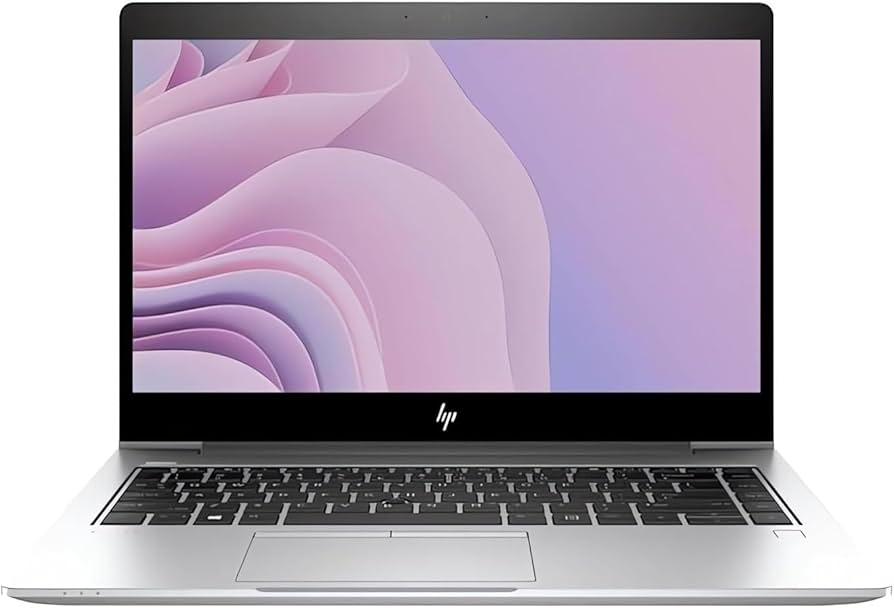
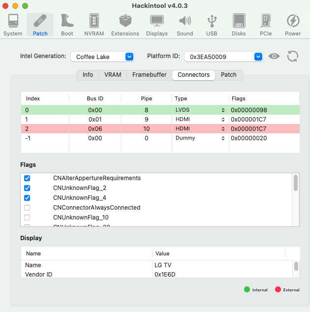
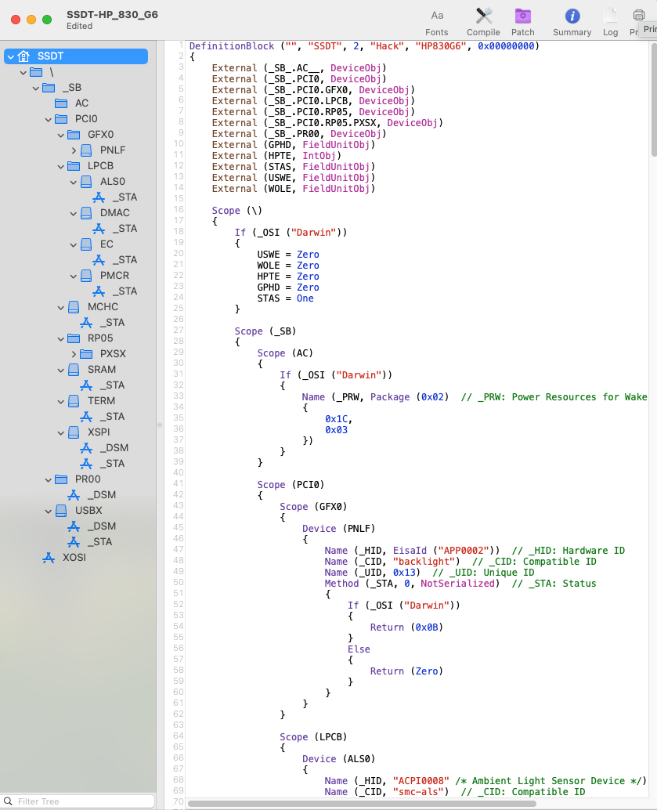

[](https://github.com/Baio1977?tab=repositories)
[](https://t.me/HackintoshLife_it)

# HP Elitebook 830 G6




## Information

- Bios Version: latest R70
- ME Firmware - Enable
- Intel i5-8365U with UHD 620
- 16 GB DDR4
- PNY 1TB NVMe SSD
- AX200 wifi / bluetooth

## What Works

- CPU and iGPU
- Speakers /  Headphones output
- Trackpad
- Joystick Mouse
- USB Ports (Including USB-C Port)
- LAN / Ethernet
- Fn keys
- Battery Status
- Wi-Fi / Bluetooth
- HDMI output ( HDMI - Type-C -TB3 )
- Sleep

## USB


## Display Output




## SSDT Full Hack




## BIOS Settings

- You can enable Fastboot, VTd and VTx

- Disable Legacy boot and Secure boot

- iGPU Memory (DVMT) set to 64MB

- disable wake on LAN/USB whatever for sleep to work

## Disable hibernation by follow steps:

```bash
sudo pmset -a hibernatemode 0
sudo rm /var/vm/sleepimage
sudo mkdir /var/vm/sleepimage
sudo pmset -a standby 0
sudo pmset -a autopoweroff 0
```
